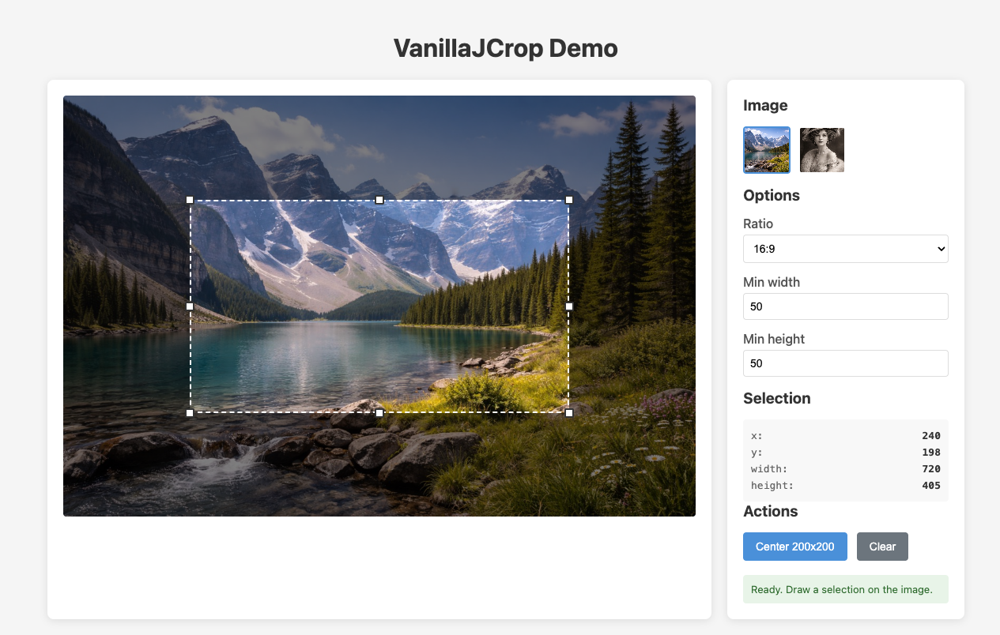

# VanillaJCrop

**VanillaJCrop** is a modern, dependency-free **JavaScript image cropping library** — a drop-in **image cropper** delivered as a Web Component. Replacement for the classic [JCrop 0.9](https://github.com/tapmodo/Jcrop) without jQuery.

**[→ Live demo](https://tijoladev.github.io/vanilla-jcrop/demo/)**



## Philosophy

VanillaJCrop is deliberately **simple and opinionated**: one selection, the eight classic handles, sane defaults. It targets the standard crop use cases — avatar pickers, thumbnails, aspect-ratio-locked boxes — and stops there.

If you need rotation, free transforms, multi-crop, canvas export with filters, or deep template overrides, reach for [CropperJS](https://github.com/fengyuanchen/cropperjs) instead — it already does that well. VanillaJCrop's value proposition is the **opposite**: a small, readable codebase with a minimal public API that you can drop in and forget about.

## Features

- **Zero dependencies** - Pure ES6+ JavaScript, no jQuery required
- **Web Component** - Use as `<jcrop-widget>` custom element
- **Headless API** - Core logic separated from UI for maximum flexibility
- **Touch support** - Works with mouse, touch, and pen input via Pointer Events
- **Keyboard navigation** - Arrow keys to move selection, Escape to cancel
- **Aspect ratio** - Lock to any ratio (16:9, 4:3, 1:1, etc.)
- **Size constraints** - Set minimum and maximum dimensions
- **Visual aids** - Opt-in rule-of-thirds grid and centre crosshair, useful for photo cropping composition
- **UX locks** - Granular control: lock position, lock size, configurable outside-click release
- **Animations** - Smooth animated transitions between selections
- **Themeable** - Customize appearance via CSS custom properties
- **Shadow DOM** - Encapsulated styles that won't conflict with your page

## Installation

### Via script tag (ES modules)

```html
<script type="module">
  import JCrop, { JCropWidget } from './src/index.js';
</script>
```

### Manual download

Download the `src/` folder and include it in your project.

## Quick Start

### Using the Web Component

```html
<jcrop-widget
  src="image.jpg"
  ratio="16/9"
  min-width="100">
</jcrop-widget>

<script type="module">
  import { JCropWidget } from './src/index.js';

  const cropper = document.querySelector('jcrop-widget');

  cropper.addEventListener('crop-select', (e) => {
    console.log('Selection:', e.detail);
    // { x, y, w, h, x2, y2 } in image coordinates
  });
</script>
```

### Using the Headless API

```javascript
import JCrop from './src/index.js';

const jcrop = new JCrop(element, {
  canvasWidth: 800,
  canvasHeight: 600,
  imageWidth: 1600,
  imageHeight: 1200,
  ratio: 16/9,
  minWidth: 100,
  minHeight: 100,
  onChange: (coords) => console.log('Changed:', coords),
  onSelect: (coords) => console.log('Selected:', coords),
  onRelease: () => console.log('Released')
});

// Set selection programmatically
jcrop.setSelect({ x: 100, y: 100, x2: 500, y2: 400 });

// Animate to a new selection
jcrop.animateTo({ x: 200, y: 200, x2: 600, y2: 500 });

// Get current selection
const coords = jcrop.tellSelect();

// Release selection
jcrop.release();
```

## Web Component Attributes

| Attribute | Description | Example |
|-----------|-------------|---------|
| `src` | Image source URL | `src="photo.jpg"` |
| `ratio` | Aspect ratio (number or fraction) | `ratio="16/9"` or `ratio="1.5"` |
| `min-width` | Minimum selection width (pixels) | `min-width="100"` |
| `min-height` | Minimum selection height (pixels) | `min-height="100"` |
| `max-width` | Maximum selection width (pixels) | `max-width="500"` |
| `max-height` | Maximum selection height (pixels) | `max-height="500"` |
| `disabled` | Disable all interaction | `disabled` |
| `selection` | Initial selection in image coords, as `x,y,x2,y2` | `selection="100,50,400,300"` |
| `grid` | Show a rule-of-thirds grid inside the selection | `grid` |
| `crosshair` | Show a centre crosshair inside the selection | `crosshair` |
| `no-move` | Lock the selection position (drag disabled) | `no-move` |
| `no-resize` | Lock the selection size (handles hidden, new-draw disabled) | `no-resize` |
| `outside-click` | What a click on empty area does: `release` (default) clears the selection, `ignore` leaves it untouched | `outside-click="ignore"` |

## Web Component Events

| Event | Description | Detail |
|-------|-------------|--------|
| `crop-change` | Fires during drag | `{ x, y, w, h, x2, y2 }` |
| `crop-select` | Fires when selection is finalized | `{ x, y, w, h, x2, y2 }` |
| `crop-release` | Fires when selection is cleared | - |
| `crop-error` | Fires on error (e.g., image load failure) | `{ error }` |

## Web Component Properties & Methods

```javascript
const widget = document.querySelector('jcrop-widget');

// Properties
widget.value;          // Get/set selection { x, y, w, h, x2, y2 }
widget.selection;      // Alias for value
widget.jcrop;          // Access underlying JCrop instance

// Methods
widget.setSelection({ x, y, x2, y2 });
widget.animateTo({ x, y, x2, y2 }, callback);
widget.release();
widget.destroy();
```

## API Options

| Option | Type | Default | Description |
|--------|------|---------|-------------|
| `canvasWidth` | number | 800 | Display width of the crop area |
| `canvasHeight` | number | 600 | Display height of the crop area |
| `imageWidth` | number | 1600 | Actual image width |
| `imageHeight` | number | 1200 | Actual image height |
| `ratio` | number\|null | null | Aspect ratio (width/height), null for free |
| `minWidth` | number | 0 | Minimum selection width (0 = no constraint) |
| `minHeight` | number | 0 | Minimum selection height (0 = no constraint) |
| `maxWidth` | number | Infinity | Maximum selection width |
| `maxHeight` | number | Infinity | Maximum selection height |
| `fadeTime` | number | 400 | Animation duration in ms |
| `onChange` | function | null | Callback during selection changes |
| `onSelect` | function | null | Callback when selection is finalized |
| `onRelease` | function | null | Callback when selection is released |

## API Methods

```javascript
// Selection
jcrop.setSelect({ x, y, x2, y2 });   // Set selection immediately
jcrop.animateTo({ x, y, x2, y2 });   // Animate to selection
jcrop.tellSelect();                   // Get selection in image coords
jcrop.tellScaled();                   // Get selection in canvas coords
jcrop.release();                      // Clear selection

// Coordinate conversion (arbitrary rects)
jcrop.toImage({ x, y, x2, y2 });      // Canvas coords → image coords
jcrop.toCanvas({ x, y, x2, y2 });     // Image coords → canvas coords

// Animation
jcrop.isAnimating();                  // Check if animating
jcrop.cancelAnimation();              // Stop animation

// Configuration
jcrop.setOptions({ ratio: 1 });       // Update options at runtime

// Cleanup
jcrop.dispose();                      // Destroy instance
```

## Sizing / Responsive

The widget is a `display: block` element. Style the **host** (`<jcrop-widget>`), not the internal `` — the image lives inside a Shadow DOM and is intentionally not reachable from outside CSS.

Once the image loads, the host's `aspect-ratio` is set to the image's natural ratio. This lets the browser honour **both** `max-width` and `max-height` on the host: whichever constraint is tighter wins, and the other dimension shrinks proportionally. Examples:

```css
/* Constrain by width */
jcrop-widget {
  display: block;
  max-width: 90vw;
  margin: 0 auto;
}

/* Constrain by height (useful when vertical space is the real limit) */
jcrop-widget {
  display: block;
  max-height: 400px;
}

/* Constrain by both — the host picks the fitting size automatically */
jcrop-widget {
  display: block;
  max-width: 600px;
  max-height: 400px;
}
```

The widget observes its own size via `ResizeObserver` and automatically recomputes coordinate mapping when the host is resized (window resize, container reflow, etc.), so selections stay aligned.

## CSS Theming

Customize the appearance using CSS custom properties:

```css
jcrop-widget {
  /* Shade overlay */
  --jcrop-shade-color: rgba(0, 0, 0, 0.5);

  /* Selection border */
  --jcrop-border-color: #fff;
  --jcrop-border-width: 2px;
  --jcrop-border-style: dashed;

  /* Resize handles */
  --jcrop-handle-size: 12px;
  --jcrop-handle-color: #fff;
  --jcrop-handle-border: 2px solid #333;
  --jcrop-handle-radius: 2px;

  /* Grid overlay (when `grid` attribute is set) */
  --jcrop-grid-color: rgba(255, 255, 255, 0.35);
  --jcrop-grid-width: 1px;

  /* Centre crosshair (when `crosshair` attribute is set) */
  --jcrop-crosshair-color: rgba(255, 255, 255, 0.7);
  --jcrop-crosshair-size: 12px;
  --jcrop-crosshair-width: 1px;

  /* Keyboard focus ring on the crop container */
  --jcrop-focus-outline: 2px solid #4a90d9;

  /* Transition applied to the selection / shade on programmatic moves
     (0ms by default for snappy drag; raise it to animate setSelect calls) */
  --jcrop-transition-duration: 0ms;
}
```

## Keyboard Shortcuts

| Key | Action |
|-----|--------|
| Arrow keys | Move selection by 1px (10px with Shift) |
| Escape | Cancel current operation |
| Enter | Confirm selection |

## Migration from JCrop 0.9

VanillaJCrop provides a familiar API for users of the original JCrop 0.9:

| JCrop 0.9 | VanillaJCrop |
|-----------|--------------|
| `$.Jcrop('#target')` | `new JCrop(element)` |
| `api.setSelect([x,y,x2,y2])` | `jcrop.setSelect({x,y,x2,y2})` |
| `api.animateTo([x,y,x2,y2])` | `jcrop.animateTo({x,y,x2,y2})` |
| `api.tellSelect()` | `jcrop.tellSelect()` |
| `api.release()` | `jcrop.release()` |
| `api.destroy()` | `jcrop.dispose()` |

Main differences:
- No jQuery dependency
- Coordinates passed as objects `{x, y, x2, y2}` instead of arrays
- Web Component available for declarative usage
- ES modules instead of global namespace

## Browser Support

VanillaJCrop works in all modern browsers:
- Chrome/Edge 79+
- Firefox 63+
- Safari 13.1+

## Development

```bash
# Start development server
./serve.sh

# Open demo
open http://localhost:8000/demo/
```

## License

MIT License - see [LICENSE](LICENSE) file.

## Credits

Inspired by the original [JCrop 0.9](https://github.com/tapmodo/Jcrop) by Kelly Hallman (Tapmodo).
